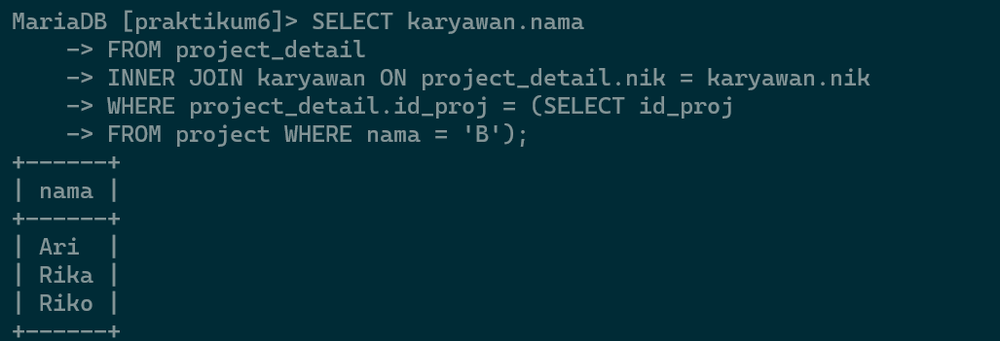

# **PRAKTIKUM6_Studi-Kasus**

```
Name        : Dipca Anugrah
ID Number   : 312210666
Class       : TI.22.A.4
```

# **ER-D Karyawan**


## **Input Data**

1. Tabel Perusahaan  
   
2. Tabel Departemen  
   
3. Tabel Karyawan  
   
4. Tabel Project  
   
5. Tabel Project_detail  
   

## **SQL JOIN**

1. Menampilkan Nama Manager tiap Departement  
   **Query**
   ```sql
   Select depertemen.nama AS Departemen, karyawan.nama AS Manager
   FROM departemen
   LEFT JOIN karyawan ON karyawan.nik = departemen.manager_nik;
   ```
   **Output**  
   
2. Menampilkan Nama Supervisor tiap karyawan  
   **Query**
   ```sql
   SELECT karyawan.nik, karyawan.nama, departemen.nama AS departemen, supervisor.nik AS supervisor
   FROM karyawan
   LEFT JOIN karyawan AS supervisor ON supervisor.nik = karyawan.sup_nik
   LEFT JOIN departemen ON departemen.id_dept = karyawan.id_dept;
   ```
   **Output**  
   
3. Menampilkan daftar karyawan yang bekerja pada project A  
   **Query**
   ```sql
   SELECT karyawan.nik, karyawan.nama
   FROM karyawan
   JOIN project_detail ON project_detail.nik = karyawan.nik
   JOIN project ON project.id_proj = projerct.id_proj
   WHERE project.nama = 'A';
   ```
   **Output**  
   

## **Latihan Praktikum**

Buat query untuk menampilkan:

1. Departemen apa saja yang terlibat dalam tiap-tiap project  
   **Query**
   ```sql
   SELECT project.nama AS Project, GROUP_CONCAT(departemen.nama) AS Departemen
   FROM project
   INNER JOIN project_detail ON project.id_proj = project_deta9l.id_proj
   INNER JOIN karyawan ON project_detail.nik = karyawan.nik
   INNER JOIN departemen ON karyawayan.id_dept = departemen.id_dept
    GROUP BY projeC.id_proj;
   ```
   **Output**  
   
2. Jumlah karyawan tiap departemen yang bekerja pada tiap-tiap project  
    **Query**
   ```sql
    SELECT project.nama AS Preject, depertemen.nama AS  Departemen, COUNT(*) AS 'Jumlah Karyawan'
    FROM project
    INNER JOIN project_detail ON project.id_proj = project_detail.id_proj
    INNER JOIN karyawan ON project_detail.nik = karyawan.nik
    INNER JOIN departemen ON karyawan.id_dept = departemen.id_dept
    GROUP BY project.id_proj, departemen.id_dept;
   ```
   **Output**  
    
3. Ada berapa project yang sedang dikerjakan oleh departemen RnD? (ket: project berjalan adalah yang statusnya 1)  
    **Query**
   ```sql
    SELECT COUTN(*) AS 'Jumlah Project'
    FROM project
    INNER JOIN project_detail ON project.id_proj = project_detail.id_proj
    INNER JOIN karyawan ON project_detail.nik = karyawan.nik
    INNER JOIN departemen ON karyawan.id_dept = depaertemen.id_dept
    WHERE departemen.nama = 'RnB' AND project.ststus = 1;
   ```
   **Output**  
    
4. Berapa banyak project yang sedang dikerjakan oleh Ari?  
    **Query**
   ```sql
    SELECT COUNT(*) AS 'Jumlah Project'
    FROM project_detail
    INNER JOIN karyawan ON project_detail.nik = karyawan.nik
    WHERE karyawan.nama = 'Ari' AND project_detail.id_proj IN (SELECT id_proj
    FROM project
    WHERE status = 1);
   ```
   **Output**  
    
5. Siapa saja yang mengerjakan project B?  
    **Query**
   ```sql
    SELECT karyawan.nama
    FROM project_detail
    INNER JOIN karyawan ON project_detail.nik = karyawan.nik
    WHERE project_detail.id_proj IN (SELECT id_proj
    FROM project WHERE nama = 'B');
   ```
   **Output**  
    
